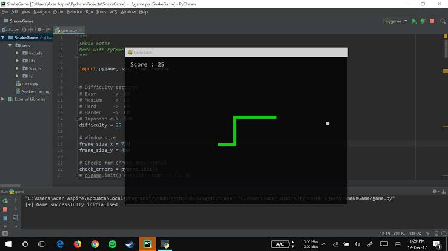
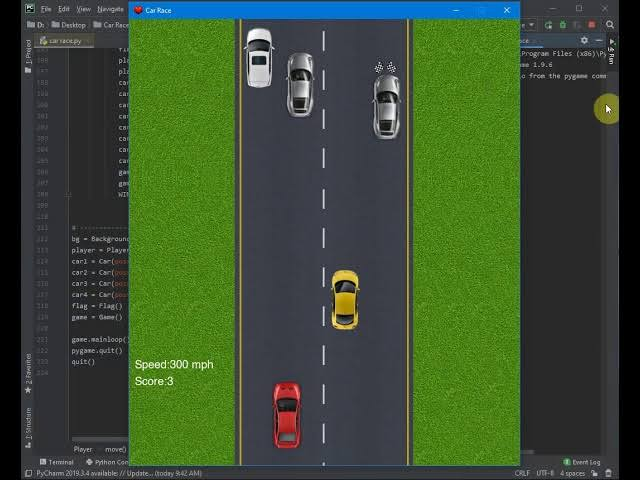
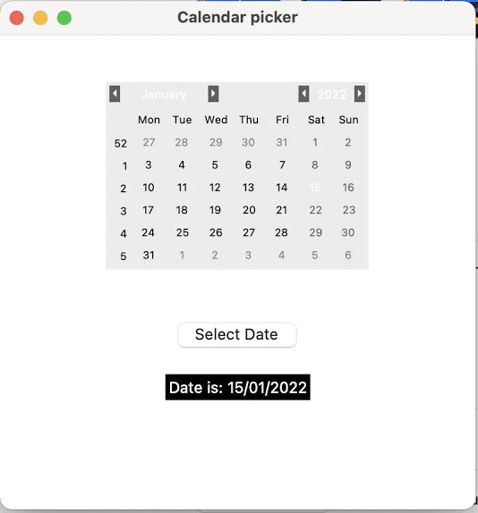
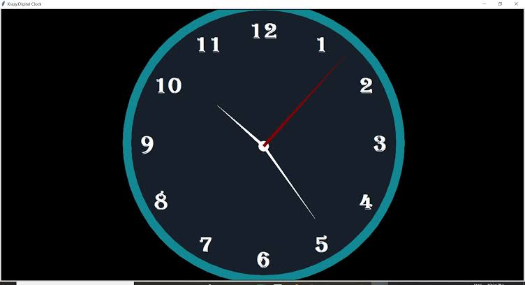

# badge

 

# License
[MIT](LICENSE)

# Warning ⚠️
> **Warning**
> 
> Please note that currently, all the resources listed below are **Unofficial** (except **[Official Resource](#official-resource)** section).
>
> Use them with cautions.

# Properites
Author: Kartik Pawar

Idea By: Github Projects, Killer Readme etc.

# The Projects
the main projects like:
## calculator project

## game projects

## calendar picker project

## clock project and more...

## INFO:

- I'm Kartik Pawar
- And I'm Indian
- I use github

You can see my projects [Here](https://github.com/dashboard)

## But if you want to make a Killer README do these few steps
1. Your Details
2. Images
3. GIFs
4. Add more detailing
5. Finish

## Bye from Kartik-
- Bye. Have a good day
